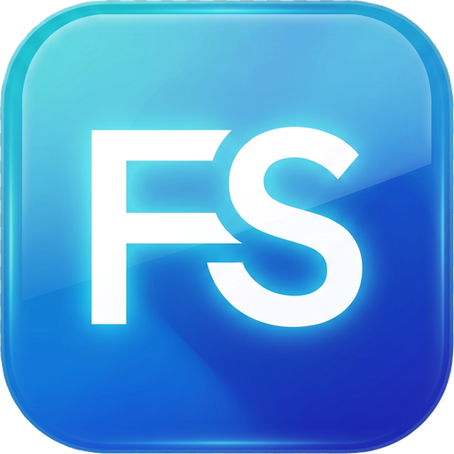
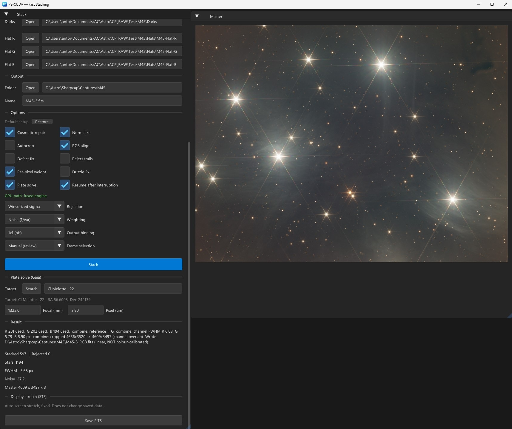
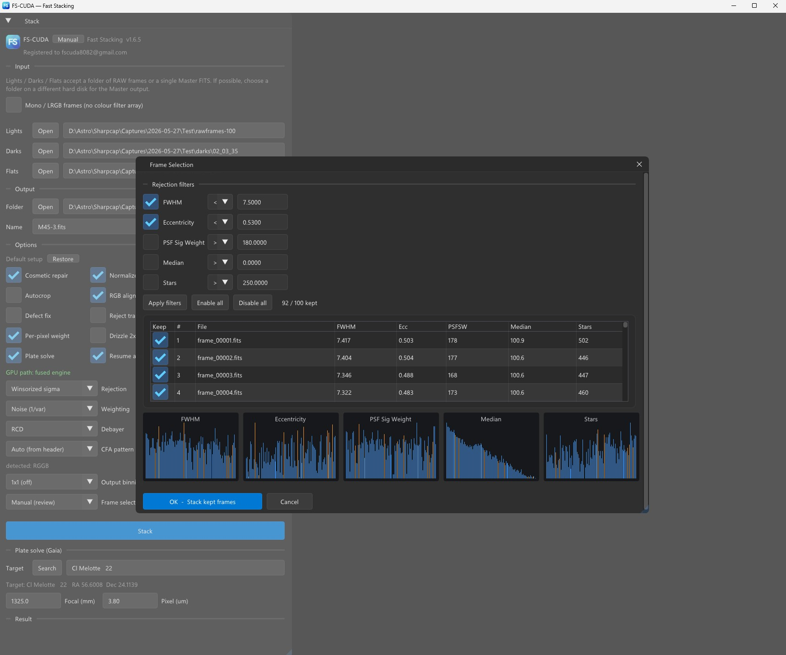

  

  
   
  <em>A whole LRGB night in one press — 597 frames, three masters and the combined colour image.</em>
   
  <em>Une nuit LRVB complète en une fois — 597 poses, trois maîtres et l'image couleur combinée.</em>

  
   
  <em>Frame selection: every frame measured, filtered and charted before you commit.</em>
   
  <em>Sélection des poses : chaque image mesurée, filtrée et tracée avant de valider.</em>

# FS-CUDA — Fast Stacking CUDA

The fastest possible astrophotography stacker for one-shot-colour (OSC) **and
monochrome** cameras, from raw light frames to a finished linear master, on your
NVIDIA GPU. A single Windows executable.

*L'empileur d'astrophotographie le plus rapide possible, pour caméras couleur
(OSC) **et monochromes** : de vos poses brutes à un maître linéaire terminé, sur
votre GPU NVIDIA. Un seul exécutable Windows.*

*Le manuel complet est disponible en français : **[GUIDE.md](GUIDE.md)**.
Chaque section ci-dessous est également traduite.*

> **Proprietary donationware — not open source.** By downloading, installing, or
> using FS-CUDA you accept the End-User License Agreement shown on first launch
> (also in `EULA.txt`). If you do not agree, do not install or use it.
>
> **Donationware propriétaire — code source fermé.** En téléchargeant, en
> installant ou en utilisant FS-CUDA, vous acceptez le contrat de licence
> utilisateur affiché au premier lancement (également dans `EULA.txt`). Si vous
> n'êtes pas d'accord, n'installez pas et n'utilisez pas le logiciel.

## What it does

Point it at a folder of raw CFA lights (plus optional darks/flats or master dark/flat), press
**Stack**, and it produces a deep, linear, 32-bit master with full metadata:
calibrate → cosmetic → RCD debayer → register (sub-pixel) → local normalize →
inverse-variance weighted, robustly-rejected integration → optional drizzle,
autocrop, RGB align and built-in Gaia plate solving. The fused GPU engine holds
RAM and VRAM **flat** no matter how many frames you stack (up to 10,000) — a
1089-frame run measured 62% GPU utilisation with steady memory.

### Ce que fait le logiciel

Indiquez-lui un dossier de poses CFA brutes (plus, en option, darks/flats
ou dark/flat maîtres), appuyez sur **Stack**, et il produit un maître linéaire 32 bits,
profond et complet en métadonnées : calibration → cosmétique → dématriçage RCD →
alignement (précision inférieure au pixel) → normalisation locale → intégration
pondérée par l'inverse de la variance avec rejet robuste → drizzle optionnel,
rognage automatique, alignement RVB et astrométrie Gaia intégrée. Le moteur GPU
fusionné garde une consommation mémoire **stable** quel que soit le nombre
d'images empilées (jusqu'à 10 000) — un traitement de 1089 poses a mesuré 62 %
d'utilisation du GPU, à mémoire constante.

## Monochrome cameras and LRGB

Tick **Mono / LRGB frames** and nothing is demosaiced: the master stays a single
channel at full sensor resolution.

Tick **LRGB batch** as well and every filter is stacked in one press, writing
`<name>_R.fits`, `<name>_G.fits`, `<name>_B.fits` (and `_L` when you shoot
luminance). Choose how your frames are organised:

- **A folder per filter** — one lights folder and one flat per filter, with a
  single shared Darks row. Darks do not depend on the filter; flats do, because
  dust shadows and vignetting move with it.
- **One folder, split by FITS `FILTER` header** — for a session captured
  straight into a single directory. Each frame's `FILTER` card decides its
  channel, the folder is searched recursively, and calibration frames are
  skipped by their `IMAGETYP`. Press **Scan filters** to see the split before
  committing to a long run. A filter that is not recognised is **reported, never
  guessed** — silently treating Ha as red would give you a plausible, wrong
  image.

Tick **Combine to RGB** and the finished masters are registered onto a common
frame and written as one colour image `<name>_RGB.fits`. L is applied as
luminance when present. Channel backgrounds are matched by offset, the edges
where the channels do not overlap are trimmed, and the per-channel FWHM is
reported so you are told when the channels differ in sharpness. **The result is
linear and registered but NOT colour-calibrated**: making red mean red needs
photometry against a star catalogue, so do that in your processing software.

Measured on a real 597-frame session (R 201 · G 202 · B 194, 4656 × 3520 mono,
eight nights): **1 min 16 s** for three masters plus the combined RGB, every
frame used. Monochrome runs on the fused GPU engine, like colour: the band
kernels carry a single channel and skip the demosaic, which also lets each band
be about three times taller for the same video memory.

### Caméras monochromes et LRVB

Cochez **Mono / LRGB frames** : plus aucun dématriçage, le maître reste en un
seul canal à la pleine résolution du capteur.

Cochez également **LRGB batch** et tous les filtres sont empilés en une seule
fois, produisant `<nom>_R.fits`, `<nom>_G.fits`, `<nom>_B.fits` (et `_L` si vous
photographiez la luminance). Choisissez l'organisation de vos fichiers :

- **Un dossier par filtre** — un dossier de poses et un flat par filtre, avec une
  seule ligne Darks partagée. Les darks ne dépendent pas du filtre ; les flats
  si, car les poussières et le vignettage suivent le filtre.
- **Un seul dossier, réparti par l'en-tête FITS `FILTER`** — pour une session
  enregistrée directement dans un seul répertoire. La carte `FILTER` de chaque
  pose détermine son canal, le dossier est parcouru récursivement, et les images
  de calibration sont ignorées grâce à leur `IMAGETYP`. Appuyez sur **Scan
  filters** pour vérifier la répartition avant de lancer un long traitement. Un
  filtre non reconnu est **signalé, jamais deviné** : traiter silencieusement du
  Ha comme du rouge donnerait une image plausible et fausse.

Cochez **Combine to RGB** et les maîtres obtenus sont alignés sur une référence
commune puis écrits en une seule image couleur `<nom>_RGB.fits`. La luminance est
appliquée lorsqu'elle existe. Les fonds de ciel sont ajustés par décalage, les
bords où les canaux ne se recouvrent pas sont rognés, et la FWHM de chaque canal
est indiquée afin de vous avertir si leur netteté diffère. **Le résultat est
linéaire et aligné mais PAS étalonné en couleur** : pour que le rouge signifie
vraiment le rouge, il faut une photométrie sur un catalogue d'étoiles — faites-le
dans votre logiciel de traitement.

Mesuré sur une session réelle de 597 poses (R 201 · G 202 · B 194, 4656 × 3520
monochrome, huit nuits) : **1 min 16 s** pour les trois maîtres et l'image RVB
combinée, toutes les poses utilisées. Le monochrome utilise le moteur GPU
fusionné, comme la couleur : les noyaux de bande ne portent qu'un seul canal et
sautent le dématriçage, ce qui permet aussi des bandes environ trois fois plus
hautes à mémoire vidéo égale.

## User manual / Manuel utilisateur

**[GUIDE.md](GUIDE.md)** is the complete manual, in English and French. It
covers how the pipeline works, every option one by one, drizzle and dithering,
plate solving, reading the results, and troubleshooting.

Safe defaults for deep-sky OSC (already the defaults in the app):
**RCD · Winsorized Sigma · Noise (1/var)**, with every repair option ticked.
Change them only for the specific reasons given in the guide.

**[GUIDE.md](GUIDE.md)** est le manuel complet, en anglais et en français. Il
explique le fonctionnement du pipeline, chaque option une par une, le drizzle et
le dithering, l'astrométrie, la lecture des résultats et le dépannage.

Réglages sûrs pour le ciel profond OSC (déjà les valeurs par défaut) :
**RCD · Winsorized Sigma · Noise (1/var)**, avec toutes les options de
réparation cochées. Ne les changez que pour les raisons précises données dans le
guide.

## Requirements

- Windows 10/11, 64-bit.
- A CPU with **AVX2** (Intel 2013 or newer, AMD 2015 or newer). The program says
  so clearly and exits if yours does not support it.
- An NVIDIA GPU, **GeForce GTX 16-series / RTX 20-series or newer** (Turing or
  later). Older or non-NVIDIA machines run a slower CPU-only fallback.
- The Microsoft Visual C++ Redistributable (x64) — bundled by the installer.
- No CUDA toolkit install needed; the runtime is built in.

### Configuration requise

- Windows 10/11, 64 bits.
- Un processeur gérant l'**AVX2** (Intel 2013 ou plus récent, AMD 2015 ou plus
  récent). Le programme l'indique clairement et s'arrête si ce n'est pas le cas.
- Un GPU NVIDIA, **GeForce GTX série 16 / RTX série 20 ou plus récent**
  (Turing ou ultérieur). Les machines plus anciennes ou non NVIDIA utilisent un
  repli logiciel plus lent, uniquement sur processeur.
- Le Microsoft Visual C++ Redistributable (x64) — fourni par l'installeur.
- Aucune installation du toolkit CUDA n'est nécessaire ; l'exécution est
  intégrée.

## Free trial and donation

FS-CUDA is free to try: **10 fully functional exports**, no time limit. After
that a short donation screen appears at startup, exported FITS files carry a
watermark in their header, and the Phase-2 quality options lock (Normalize,
Autocrop, RGB align, Defect-tolerant per-pixel weighting, Reject trails and
Drizzle). Basic stacking keeps working.

> # ⭐ Donate — from **2 EURO**
> ### 👉 **https://paypal.me/Antoine8082**
>
> **A donation of at least 2 EURO unlocks FS-CUDA permanently on your machine:**
> no startup screen, no watermark, and the full Phase-2 quality engine.
>
> FS-CUDA is developed by one person. If it saves you time, please support it.

Then, to receive your key:

1. Donate: **https://paypal.me/Antoine8082** — **minimum 2 EURO**
2. In FS-CUDA, open **Enter license** and copy your **Machine ID**
   (`HWID-XXXX-XXXX`).
3. Send that Machine ID and your PayPal email to the developer at
   **fscuda8082@gmail.com**.
4. Paste the license key you receive back — done, permanently, on this machine.

Your license is bound to your hardware; please do not share it. If you change
your motherboard or CPU, contact the developer for a reset.

### Essai gratuit et don

FS-CUDA est libre d'essai : **10 exports pleinement fonctionnels**, sans limite
de durée. Ensuite, un court écran de don apparaît au démarrage, les fichiers
FITS exportés portent un filigrane dans leur en-tête, et les options de qualité
Phase 2 se verrouillent (Normalize, Autocrop, RGB align, pondération par pixel,
Reject trails et Drizzle). L'empilement de base continue de fonctionner.

> # ⭐ Faire un don — à partir de **2 EURO**
> ### 👉 **https://paypal.me/Antoine8082**
>
> **Un don d'au moins 2 EURO déverrouille FS-CUDA définitivement sur votre
> machine :** plus d'écran de démarrage, plus de filigrane, et le moteur de
> qualité Phase 2 au complet.
>
> FS-CUDA est développé par une seule personne. S'il vous fait gagner du temps,
> merci de le soutenir.

Ensuite, pour recevoir votre clé :

1. Faites un don : **https://paypal.me/Antoine8082** — **2 EURO minimum**
2. Dans FS-CUDA, ouvrez **Enter license** et copiez votre **Machine ID**
   (`HWID-XXXX-XXXX`).
3. Envoyez ce Machine ID et l'adresse e-mail de votre PayPal au développeur à
   **fscuda8082@gmail.com**.
4. Collez la clé de licence reçue en retour — c'est définitif, sur cette
   machine.

Votre licence est liée à votre matériel ; merci de ne pas la partager. Si vous
changez de carte mère ou de processeur, contactez le développeur pour une
réinitialisation.

## Benchmark

Measured on **FS-CUDA 1.11.16**, on a Lenovo Yoga Pro 9 16IAH10 — Core Ultra 9
285H (16 threads), 64 GB RAM, **RTX 5070 Laptop** — stacking **1089 real light
frames of 3008 × 3008 px** (OSC/CFA, 16-bit) from an internal NVMe SSD. Times
are the full run: reading every frame, registering, integrating and writing the
master.

| Settings | Time |
|---|---|
| Normalize + Autocrop + RGB align + Per-pixel weight + Defect fix (RCD debayer, Winsorized Sigma, Noise weighting) | **3 min 08 s** |
| Same, plus Reject trails | **3 min 02 s** |
| Same, with Defect fix unticked | **3 min 09 s** |

Memory use stays flat regardless of how many frames you stack.

**Reject trails costs nothing here, and the table is not a misprint.** Local
normalization reads the very frames the trail pass has already prepared, so with
Normalize on the two share that work; switch trails off and normalization has to
prepare them itself. If you are already normalizing, trail rejection is free.

**Defect fix is now free.** It has been on by default since 1.11.10, and it used
to cost 26 seconds on this set. Since 1.11.16 the table cannot tell you whether
it is on: 3 min 08 s with, 3 min 09 s without. It still produces a master
identical to the last bit here, because this sensor is clean — but on a camera
with a bad column it repairs it, and it no longer asks anything in return.

**Every option now runs on the fused GPU engine.** Drizzle, defect repair, the
GESD and Linear fit rejection modes and the SuperPixel debayer each moved onto it
between 1.11.9 and 1.11.15, and each was verified to produce a master identical
to the older engine's, to the last bit, before it shipped. The classic engine
remains only for machines with no CUDA graphics card, for lights that are not
16-bit, and for stacks too small to be worth the setup.

### Performances mesurées

Mesuré sur **FS-CUDA 1.11.16**, sur un Lenovo Yoga Pro 9 16IAH10 — Core Ultra 9
285H (16 threads), 64 Go de RAM, **RTX 5070 Laptop** — pour l'empilement de
**1089 poses réelles de 3008 × 3008 px** (CFA/OSC, 16 bits) depuis un SSD NVMe
interne. Les durées correspondent au traitement complet : lecture de chaque
pose, alignement, intégration et écriture du maître final.

| Réglages | Durée |
|---|---|
| Normalize + Autocrop + RGB align + pondération par pixel + Defect fix (dématriçage RCD, Winsorized Sigma, pondération Noise) | **3 min 08 s** |
| Idem, plus Reject trails | **3 min 02 s** |
| Idem, avec Defect fix décoché | **3 min 09 s** |

La consommation mémoire reste stable quel que soit le nombre d'images.

**Reject trails ne coûte rien ici, et le tableau n'est pas une coquille.** La
normalisation locale lit précisément les images que la passe de traînées a déjà
préparées : avec Normalize activé, les deux se partagent ce travail ; sans
traînées, la normalisation doit les préparer elle-même. Si vous normalisez déjà,
la réjection des traînées est gratuite.

**Defect fix est désormais gratuite.** Activée par défaut depuis la 1.11.10,
elle coûtait 26 secondes sur cette série. Depuis la 1.11.16, le tableau ne
permet plus de dire si elle est active : 3 min 08 s avec, 3 min 09 s sans. Elle
produit toujours ici un maître identique au bit près, le capteur étant sain —
mais sur une caméra présentant une colonne défectueuse, elle la répare, et ne
demande plus rien en échange.

**Toutes les options tournent désormais sur le moteur GPU fusionné.** Le drizzle,
la réparation des défauts, les modes de réjection GESD et Linear fit et le
dématriçage SuperPixel y ont été portés entre la 1.11.9 et la 1.11.15, chacun
vérifié comme produisant un maître identique au bit près à celui de l'ancien
moteur avant sa publication. Le moteur classique ne sert plus que pour les
machines sans carte CUDA, les poses qui ne sont pas en 16 bits, et les piles trop
petites pour justifier la mise en place.

## Updates

**Check for updates** in the program compares your version with the latest
release and updates the executable in place. **Your license is preserved.**

### Mises à jour

**Check for updates** dans le programme compare votre version à la dernière
publiée et met à jour l'exécutable sur place. **Votre licence est conservée.**

## Support

Questions, license requests and hardware-change resets: contact the developer
via fscuda8082@gmail.com.

### Assistance

Questions, demandes de licence et réinitialisation après changement de matériel :
contactez le développeur à fscuda8082@gmail.com.

---

*FS-CUDA is provided "as is", without warranty of any kind. See `EULA.txt`.*

*FS-CUDA est fourni « en l'état », sans garantie d'aucune sorte. Voir
`EULA.txt`.*
